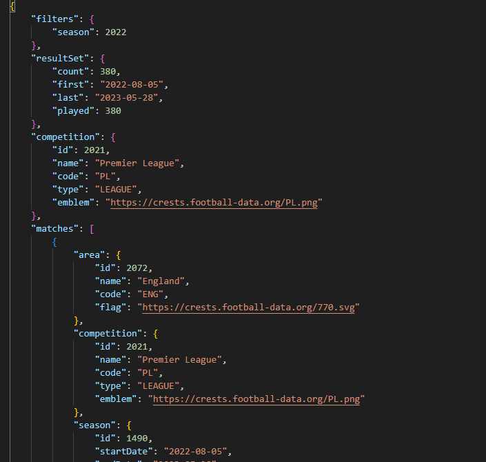
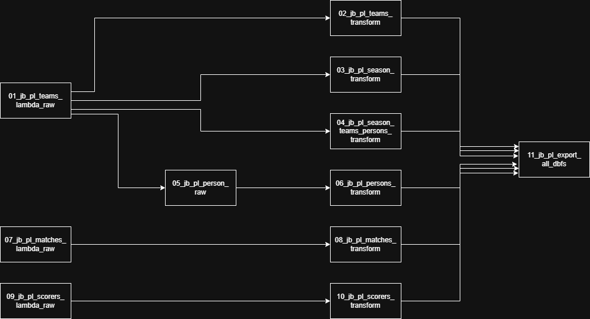
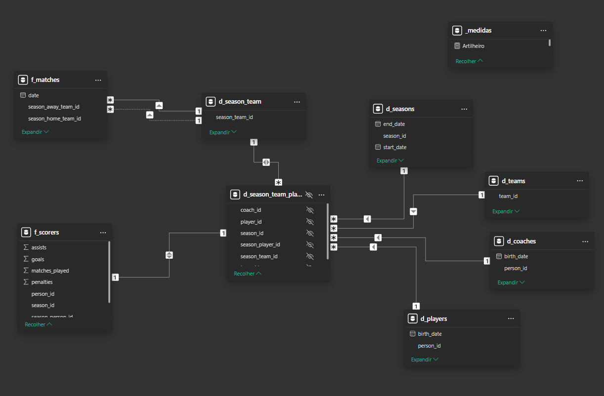
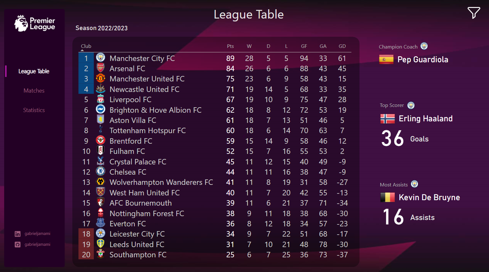
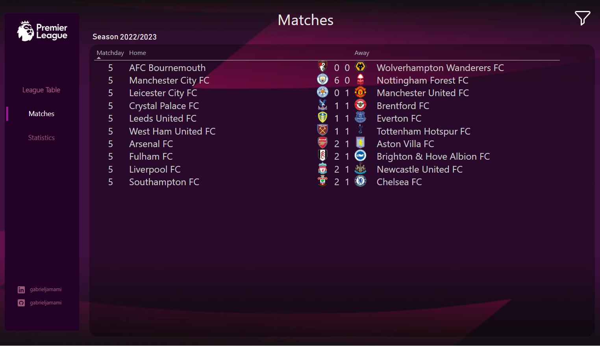
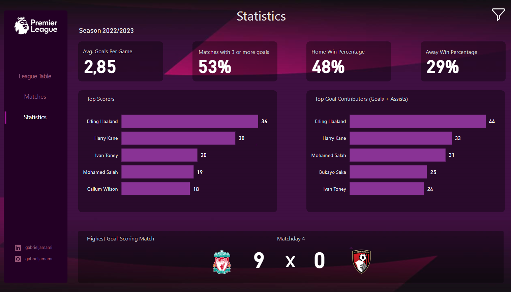

# ⚽ FutebolTotal220 - Pipeline de Dados da Premier League  

**Acesse o Dashboard**: [Link para o Dashboard](https://app.powerbi.com/view?r=eyJrIjoiZTQwZTY4YjItNmM4YS00ZTg2LWI1ZTQtYjYxMzEzNjI1MjZjIiwidCI6ImZiYmE0ZjhmLWYzNmUtNDUzNC04ZWZiLThhOWU1ODU4YTk4ZSJ9)  

O **FutebolTotal220** é um projeto que combina Engenharia de Dados e Business Intelligence para processar, analisar e visualizar dados de futebol. Utilizando diversas ferramentas do AWS, Databricks e Power BI, o projeto automatiza a coleta e o tratamento de dados, transformando-os em insights sobre a Premier League (Campeonato Inglês de Futebol).

---

## 🛠️ Metodologias, Linguagens e Ferramentas

- **Metodologias**:  
  - **ETL (Extract, Transform, Load)**  
  - **Modelo de dados Snowflake** no Power BI  
  - **Processamento em Batches** para controlar e processar dados em pequenas porções, garantindo otimização de recursos  
  - **Data Lake** usando o AWS S3 para armazenar dados brutos extraídos pela API, garantindo um ambiente escalável e flexível  
  - **Data Warehousing** organizando dados em tabelas estruturadas, formando um data warehouse pronto para análise.

- **Linguagens**:  
  - **Python** (para funções no AWS Lambda e processamento no Databricks)
  - **SQL** (para consultas e manipulação de dados no Databricks)
  - **PySpark** (para processamento distribuído no Databricks)

- **Ferramentas**:  
  - **AWS API Gateway**, **AWS Lambda**, **AWS S3**, **AWS IAM**, **AWS CloudWatch**, **AWS SQS**  
  - **Databricks** (para pipeline de ETL com **PySpark**)
  - **Power BI** (para visualização e criação de dashboard)

---

## 🏛️ Arquitetura do Projeto

---

## 📝 Passo a passo do projeto

#### 1️⃣ Coleta de Dados  

A API **[Football-Data.org](https://www.football-data.org/)** foi utilizada para coletar dados sobre as partidas, equipes, elencos e estatísticas da **Premier League**. Para realizar a extração dessas informações, foram desenvolvidas funções específicas no **AWS Lambda**, localizadas na pasta `/lambda_function` do repositório.  

Os principais arquivos envolvidos são:
- **matches**: Dados sobre as partidas realizadas.
- **scorers**: Informações sobre os maiores artilheiros do campeonato.
- **teams**: Dados das equipes, jogadores e técnicos.

Esses dados abrangem as temporadas de **2022/2023**, **2023/2024** e **2024/2025**.

Para acionar essas funções Lambda, foi criada uma API no **AWS API Gateway** (configuração no arquivo `swagger.json`, localizado na pasta `/api_gateway`)

📌 *Exemplo de JSON retornado pela API:*  
  

#### 2️⃣ Armazenamento dos dados raw no S3  

Os dados raw são armazenados no bucket **`futeboltotal220`** do **AWS S3**, garantindo escalabilidade e segurança. Para melhor organização, foi criada uma pasta **`raw`**, contendo as seguintes subpastas: `matches`, `persons`, `scorers` e `teams`. Essas pastas ajudam a categorizar os dados extraídos durante a coleta.

#### 3️⃣ Processamento no Databricks  

Os dados são processados em um pipeline **ETL (Extract, Transform, Load)** dentro do **Databricks**, onde são limpos, transformados e organizados.

São **11 notebooks**, localizados em `/databricks`, responsáveis pela extração e tratamento dos dados antes de enviá-los ao **Power BI**:

| **Notebooks**                                     | **Descrição**                                                                                                                                  |
|---------------------------------------------------|------------------------------------------------------------------------------------------------------------------------------------------------|
| **01_jb_pl_teams_lambda_raw.dbc**                 | Extrai dados de equipes, temporadas, jogadores e técnicos via API.                                                                            |
| **02_jb_pl_teams_transform.dbc**                  | Processa dados de equipes e grava no S3, criando a tabela **Delta**.                                                                          |
| **03_jb_pl_season_transform.dbc**                 | Processa dados de temporadas e grava no S3, criando a tabela **Delta**.                                                                       |
| **04_jb_pl_season_teams_persons_transform.dbc**    | Relaciona jogadores e técnicos a times e temporadas, criando a tabela **Delta**.                                                              |
| **05_jb_pl_persons_raw.dbc** *(destaque)*          | **Processo**:  1. Lê arquivo JSON de pessoas no S3.  2. Processa IDs não enviados.  3. Organiza em batches de 10 e salva no S3.  4. Envia um batch por vez para o **SQS** e aguarda 1 minuto antes do próximo.  **SQS e Lambda**: Processa um batch por vez, respeitando o limite da API. |
| **06_jb_pl_persons_transform.dbc**                | Processa dados de pessoas e grava no S3, criando a tabela **Delta**.                                                                          |
| **07_jb_pl_matches_lambda_raw.dbc**               | Extrai dados de partidas via API.                                                                                                             |
| **08_jb_pl_matches_transform.dbc**                | Processa dados de partidas e grava no S3, criando a tabela **Delta**.                                                                         |
| **09_jb_pl_scorers_lambda_raw.dbc**               | Extrai dados de artilheiros via API.                                                                                                          |
| **10_jb_pl_scorers_transform.dbc**                | Processa dados de artilheiros e grava no S3, criando a tabela **Delta**.                                                                      |
| **11_jb_pl_export_all_dbfs.dbc**                  | Exporta as tabelas **Delta** para arquivos **CSV** no S3, prontos para Power BI.                                                              |

Para garantir a escalabilidade e o controle do processamento dos dados, especialmente no caso de grandes volumes de dados, o processamento é feito em batches. O AWS SQS é utilizado para gerenciar a fila de execução dos batches, permitindo o processamento controlado de pequenas porções de dados, evitando sobrecarga e otimizando o uso de recursos. O Lambda processa um batch por vez, respeitando o limite da API.

📌 *Pipeline de ETL no Databricks:*  

#### 4️⃣ Armazenamento dos dados processed no S3  

Os dados processed são armazenados no bucket **`futeboltotal220`** do **AWS S3**, garantindo escalabilidade e segurança. Para melhor organização, foi criada uma pasta **`processed`**, contendo as seguintes subpastas: `matches`, `persons`, `scorers`, `season_team_player`, `season` e `teams`. Essas pastas ajudam a categorizar os dados extraídos durante a coleta.

Os arquivos csv para carregar no Power BI ficam na pasta `pbi`

#### 5️⃣ Criação do Dashboard  

**Acesse o Dashboard**: [Link para o Dashboard](https://app.powerbi.com/view?r=eyJrIjoiZTQwZTY4YjItNmM4YS00ZTg2LWI1ZTQtYjYxMzEzNjI1MjZjIiwidCI6ImZiYmE0ZjhmLWYzNmUtNDUzNC04ZWZiLThhOWU1ODU4YTk4ZSJ9)  

Após o processamento, os dados são carregados no **Power BI**, utilizando um modelo **Snowflake**. Esse modelo foi necessário porque uma equipe possui vários jogadores, e os elencos mudam a cada temporada.  

Além das tabelas criadas a partir dos arquivos CSV, foram geradas mais 3 dimensões:  

- **d_season_team**: Contém apenas uma coluna (`season_team_id`) e funciona como uma **bridge table** para evitar relações de muitos para muitos.  
- **d_coaches**: Criada a partir do arquivo `tb_persons.csv`, armazena os técnicos.  
- **d_players**: Também criada a partir do arquivo `tb_persons.csv`, armazena os jogadores.  

📌 *Modelo Snowflake aplicado no Dashboard:*  
  

A partir dessa estrutura, o dashboard foi desenvolvido com os dados da **Premier League**, dividido em **3 abas** principais:  

#### 📊 *League Table*  
Exibe a tabela de classificação da Premier League com a posição de cada clube, quantidade de pontos e outras estatísticas detalhadas.  

Também apresenta destaques como:  
- **Técnico campeão** da temporada.  
- **Artilheiro** da liga.  
- **Jogador com mais assistências**.  

O usuário pode aplicar **filtros** para visualizar dados das últimas **3 temporadas**.  

📌 *Aba League Table:*  
  

#### ⚽ *Matches*  
Apresenta todas as partidas da Premier League com os respectivos resultados.  

📌 *Aba Matches:*  
  

#### 📈 *Statistics*  
Exibe estatísticas detalhadas de cada temporada, incluindo:  
- Média de **gols por jogo**.  
- Percentual de **vitórias em casa** e **fora de casa**.  
- Jogos com **3 gols ou mais**.  
- Partida com **mais gols** na temporada.  
- Lista dos **artilheiros** e dos jogadores com mais **participações em gols**.  

📌 *Aba Statistics:*  
  

---

## Estrutura do repositório

/FutebolTotal220

│── /api_gateway        
│── /lambda_function    
│── /databricks    
│── /sqs                   
│── /s3                 
│── /powerbi            
│── /images            
│── README.md           
│── requirements.txt    
