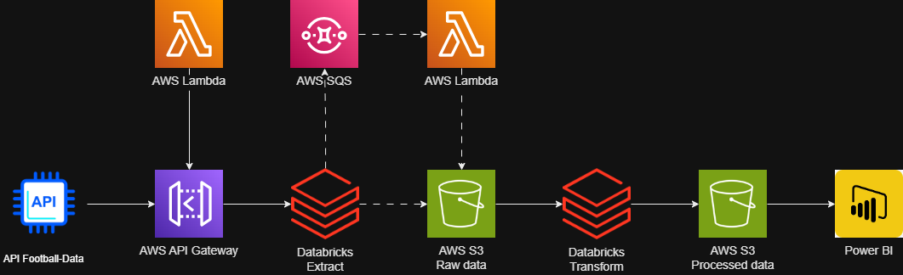
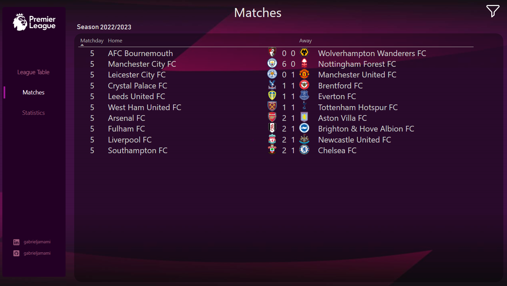

# ⚽ FutebolTotal220 - Premier League Data Pipeline  

**Access the Dashboard**: [Dashboard Link](https://app.powerbi.com/view?r=eyJrIjoiZTQwZTY4YjItNmM4YS00ZTg2LWI1ZTQtYjYxMzEzNjI1MjZjIiwidCI6ImZiYmE0ZjhmLWYzNmUtNDUzNC04ZWZiLThhOWU1ODU4YTk4ZSJ9)  

**FutebolTotal220** is a project that combines Data Engineering and Business Intelligence to process, analyze, and visualize football data. Using various AWS tools, Databricks, and Power BI, the project automates data collection and processing, transforming them into insights about the Premier League (English Football Championship).

---

## 🛠️ Methodologies, Languages, and Tools

- **Methodologies**:  
  - **ETL (Extract, Transform, Load)**  
  - **Snowflake Data Model** in Power BI  
  - **Batch Processing** to control and process data in small portions, ensuring resource optimization  
  - **Data Lake** using AWS S3 to store raw data extracted by the API, providing a scalable and flexible environment  
  - **Data Warehouse** organizing data into structured tables, creating a warehouse ready for analysis.

- **Languages**:  
  - **Python** (for AWS Lambda functions and processing in Databricks)
  - **SQL** (for queries and data manipulation in Databricks)
  - **PySpark** (for distributed processing in Databricks)

- **Tools**:  
  - **AWS API Gateway**, **AWS Lambda**, **AWS S3**, **AWS SQS**, **AWS CloudWatch**, and **AWS IAM**
  - **Databricks** (for ETL pipeline with **PySpark**)
  - **Power BI** (for visualization and dashboard creation)

---

## 🏛️ Project Architecture

---

## 📝 Project Steps

#### 1️⃣ Data Collection  

The **[Football-Data.org](https://www.football-data.org/)** API was used to collect data on matches, teams, squads, and statistics from the **Premier League**. To extract this information, specific functions were developed in **AWS Lambda**, located in the `/lambda_function` directory.

The main files involved are:
- **matches**: Data about played matches.
- **scorers**: Information about the league's top scorers.
- **teams**: Data on teams, players, and coaches.

These data cover the **2022/2023**, **2023/2024**, and **2024/2025** seasons.

To trigger these Lambda functions, an API was created in **AWS API Gateway** (configuration in `swagger.json` file, located in `/api_gateway`)

📌 *Example of JSON returned by the API:*  
  

#### 2️⃣ Storing Raw Data in S3  

Raw data is stored in the **`futeboltotal220`** bucket in **AWS S3**, ensuring scalability and security. To maintain organization, a **`raw`** folder was created, containing subfolders: `matches`, `persons`, `scorers`, and `teams`. These folders help categorize extracted data.

#### 3️⃣ Processing in Databricks  

The data is processed in an **ETL (Extract, Transform, Load)** pipeline within **Databricks**, where it is cleaned, transformed, and organized.

There are **11 notebooks**, located in `/databricks`, responsible for extracting and processing data before sending it to **Power BI**:

📌 *ETL Pipeline in Databricks:*  

#### 4️⃣ Storing Processed Data in S3  

Processed data is stored in the **`futeboltotal220`** bucket in **AWS S3**, ensuring scalability and security. To maintain organization, a **`processed`** folder was created, containing subfolders: `matches`, `persons`, `scorers`, `season_team_player`, `season`, and `teams`.

CSV files for loading into Power BI are in the `pbi` folder.

#### 5️⃣ Creating the Dashboard  

**Access the Dashboard**: [Dashboard Link](https://app.powerbi.com/view?r=eyJrIjoiZTQwZTY4YjItNmM4YS00ZTg2LWI1ZTQtYjYxMzEzNjI1MjZjIiwidCI6ImZiYmE0ZjhmLWYzNmUtNDUzNC04ZWZiLThhOWU1ODU4YTk4ZSJ9)  

After processing, the data is loaded into **Power BI**, using a **Snowflake model**. This model was necessary because a team has multiple players, and squads change each season.

Additionally, three extra dimensions were created:

- **d_season_team**: Contains only one column (`season_team_id`) and acts as a **bridge table** to avoid many-to-many relationships.
- **d_coaches**: Created from the `tb_persons.csv` file, storing coaches.
- **d_players**: Also created from the `tb_persons.csv` file, storing players.

📌 *Snowflake Model in the Dashboard:*  
  

The dashboard was developed with **Premier League** data and is divided into **3 main tabs**:

#### 📊 *League Table*  
Displays the Premier League standings, showing each club's position, points, and other detailed statistics.

Also highlights:
- **Champion coach** of the season.
- **League top scorer**.
- **Player with the most assists**.

Users can apply **filters** to view data from the last **3 seasons**.

📌 *League Table Tab:*  
  

#### ⚽ *Matches*  
Shows all Premier League matches with respective results.

📌 *Matches Tab:*  
  

#### 📈 *Statistics*  
Displays detailed statistics for each season, including:
- **Average goals per match**.
- **Percentage of home and away wins**.
- **Games with 3 or more goals**.
- **Match with the most goals in the season**.
- **List of top scorers and players with most goal contributions**.

📌 *Statistics Tab:*  
  

---

## Repository Structure

/FutebolTotal220

│── /api_gateway        
│── /lambda_function    
│── /databricks           
│── /powerbi            
│── /images            
│── README.md